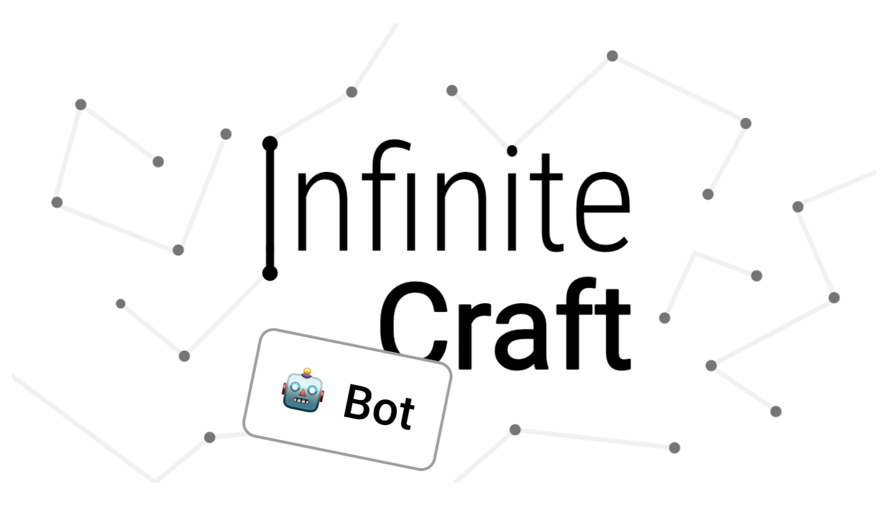

# Infinite Craft bot
This is a bot to play the game [Infinite Craft](https://neal.fun/infinite-craft/). The game starts with the four elements: Water, Fire, Wind, and Earth. You can then start combining elements to create items. For example, Earth and Water make a Plant. The game quickly starts creating many new items. For example, you can combine two Plants to create a Tree, then combine Tree and Fire to create Ash. 

My personal favorite item is Kim-Jong Boom.

## Instructions
To use the bot, you should have Node.js installed. Then, do the following:
1. Download this repository.
2. Go to your terminal and navigate to this directory.
3. Type `npm run bot`.
4. If you want to reset, type `npm run reset`.
5. If you want to visualize the items you have so far, type `npm run visualize`.

The recipes will be in `data/recipes.json`.